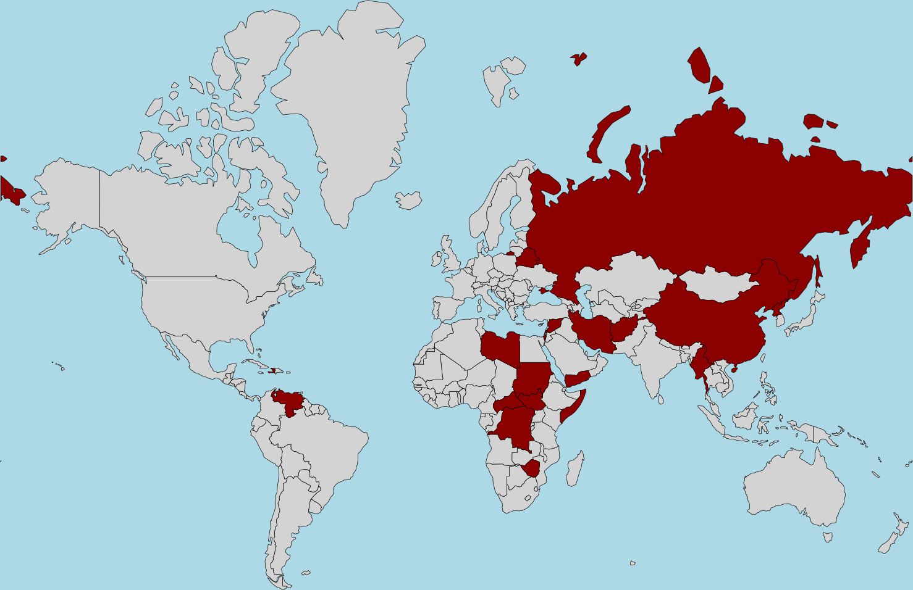
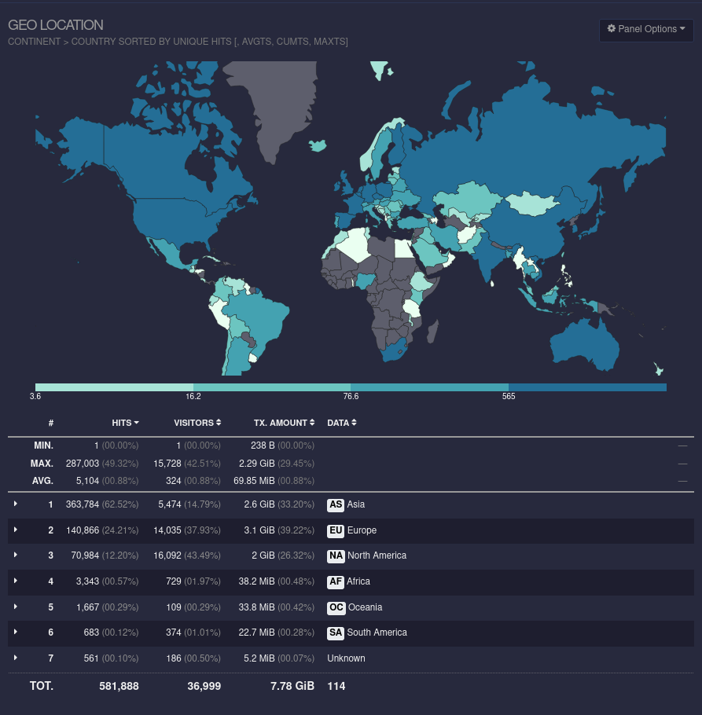

_Voor Nederlands, zie [README-nl.md](README-nl.md)_

# geoipblock

Block network traffic for IP addresses of specific countries.

> <em>The only good is knowledge and the only evil is ignorance.</em> — Socrates (469 – 399 BC) Greek philosopher in Athens

## 1 Introduction

In our increasingly interconnected world, global IT infrastructures face relentless threats from hackers, malware and the complexities of enforcing international sanctions. This is on average 30%-60% of all network traffic. It is possible to filter traffic for web servers, email servers, etc. based on the IP address of a country, but each needs separate installation, configuration and maintenance and falls short of a complete protection.

Blocking entire countries at the network layer presents a more robust solution to keep disruptive and sanctioned traffic out entirely.

This documentation, which is called geoipblock, explains how to use xtables-addons to drop all incoming and outgoing traffic on all ports on Linux servers for IP-based geographical locations, providing a stronger, centralized barrier.

Installing xtables-addons not only makes a server more secure and denies access to sanctioned countries, it also significantly reduces server load, which also results in a more sustainable situation with less power consumption.

See also https://inai.de/projects/xtables-addons/geoip.php and https://codeberg.org/jengelh/xtables-addons for more technical information. In case your organization uses network hardware from Cisco Systems, Juniper, etc., it is also possible to configure blocking on IP-based geographical locations.

## 2 Countries

Countries can be blocked by country code. The list of codes supported by xtables-addons is found at https://db-ip.com/faq.php and note there are also some additional codes other than only those of [ISO 3166-1 alpha-2](https://en.wikipedia.org/wiki/ISO_3166-1_alpha-2#Officially_assigned_code_elements). 

As an example, a list of countries has been compiled based on [EU and/or United Nations sanctions](https://www.sanctionsmap.eu/). This is not only to enforce a sanction, but it is known or highly probable that these countries do not prevent malicious traffic to EU countries. In several cases, even the governments of these countries actively create malicious traffic.

Countries with only personal sanctions are not included. Some countries that should have sanctions, but a minority veto has prevented those, are included. Again, this is just an example that is illustrated by the map and table below.

| Code | Flag | Country                                             |
|------|------|-----------------------------------------------------|
| `AF` | 🇦🇫   | Afghanistan, Islamic Emirate of                     |
| `BY` | 🇧🇾   | Belarus, Republic of                                |
| `CF` | 🇨🇫   | Central African Republic                            |
| `CN` | 🇨🇳   | China, People's Republic of                         |
| `CD` | 🇨🇩   | Congo, Democratic Republic of the                   |
| `HT` | 🇭🇹   | Haiti, Republic of                                  |
| `HK` | 🇭🇰   | Hong Kong (special administrative region of China)  |
| `IL` | 🇮🇱   | Israel, State of                                    |
| `IR` | 🇮🇷   | Iran, Islamic Republic of                           |
| `MM` | 🇲🇲   | Myanmar, Republic of the Union of                   |
| `MO` | 🇲🇴   | Macao (special administrative region of China)      |
| `KP` | 🇰🇵   | North Korea (Democratic People's Republic of Korea) |
| `LY` | 🇱🇾   | Libya, State of                                     |
| `RU` | 🇷🇺   | Russian Federation                                  |
| `SD` | 🇸🇩   | Sudan, Republic of                                  |
| `SO` | 🇸🇴   | Somalia, Federal Republic of                        |
| `SS` | 🇸🇸   | South Sudan, Republic of                            |
| `SY` | 🇸🇾   | Syria (Syrian Arab Republic)                        |
| `VE` | 🇻🇪   | Venezuela, Bolivarian Republic of                   |
| `YE` | 🇾🇪   | Yemen. Republic of                                  |
| `ZW` | 🇿🇼   | Zimbabwe, Republic of                               |

To block traffic from these countries, use below where it is written `XX,YY,ZZ`, the codes

    AF,BY,CF,CN,CD,HT,HK,IL,IR,MM,MO,KP,LY,RU,SD,SO,SS,SY,VE,YE,ZW

To get a proper insight into countries using your infrastructure, use web analytics such as [GoAccess](https://en.wikipedia.org/wiki/GoAccess). Suppose your infrastructure is only aimed at very local use, you can block countries on the other side of the world from accessing it. This will not effect your target audience and result in less resources being wasted.

See for example, the following map for a website in a European country where 67% of the 7.78 GB of the traffic is not even originating from Europe.

Of course, it is possible to circumvent this blockage with the use of a VPN. The remaining malicious traffic, which is far less, can be blocked with e.g. [Fail2Ban](https://en.wikipedia.org/wiki/Fail2ban).

## 3 Installation for Ubuntu

### 25.10 Questing Quokka

This distribution offers xtables-addons 3.27. Install software packages according to the previous version below.

### 25.04 Plucky Puffin

This distribution offers xtables-addons 3.27. Install software packages according to the previous version below.

### 24.04 LTS Noble Numbat

This distribution offers xtables-addons 3.25. Install software packages according to the previous version below.

### 23.10 Mantic Minotaur

This distribution offers xtables-addons 3.24. Install software packages according to the previous version below.

### 23.04 Lunar Lobster

This distribution offers xtables-addons 3.23. Install software packages according to the previous version below.

### 22.10 Kinetic Kudu

This distribution offers xtables-addons 3.21. Install software packages according to the previous version below.

### 22.04 LTS Jammy Jellyfish

This distribution offers xtables-addons 3.19. Install software packages according to the previous version below.

### 21.10 Impish Indri

This distribution offers xtables-addons 3.18. Install software packages according to the previous version below.

### 21.04 Hirsute Hippo

This distribution offers xtables-addons 3.13. Install software packages with

    sudo apt-get install -y xtables-addons-common libtext-csv-xs-perl libnet-cidr-lite-perl
    sudo mkdir -p /usr/share/xt_geoip/

Create the file `/etc/cron.daily/xt_geoip` containing

    #!/bin/sh -e
    workdir=$(mktemp -d)
    cd ${workdir}
    /usr/libexec/xtables-addons/xt_geoip_dl
    /usr/libexec/xtables-addons/xt_geoip_build -s > /dev/null
    cd && rm -rf ${workdir}

and give that file execution rights with

    sudo chmod a+x /etc/cron.daily/xt_geoip

### 20.04 LTS Focal Fossa

This distribution offers xtables-addons 3.9. Install software packages with

    sudo apt-get install -y xtables-addons-common libtext-csv-xs-perl libnet-cidr-lite-perl
    sudo chmod a+x /usr/lib/xtables-addons/xt_geoip_build
    sudo mkdir -p /usr/share/xt_geoip/

Create the file `/etc/cron.daily/xt_geoip` containing

    #!/bin/sh -e
    workdir=$(mktemp -d)
    cd ${workdir}
    /usr/lib/xtables-addons/xt_geoip_dl
    /usr/lib/xtables-addons/xt_geoip_build -D /usr/share/xt_geoip/ > /dev/null
    cd && rm -rf ${workdir}

and give that file execution rights with

    sudo chmod a+x /etc/cron.daily/xt_geoip

### 18.04 LTS Bionic Beaver

This distribution offers xtables-addons 3.0. Here xtables-addons uses only the maxmind geo IP database. However, that database is now available under another URL than xtables-addons expects. Additionally, this version of xtables-addons is rather old.

This manual does not yet have a workaround for the database issue, but
contributing a workaround is welcome.

## 4 Installation for Debian

### 14 Forky

This distribution offers xtables-addons 3.27. Install software packages according to the previous version below.

### 13 Trixie

This distribution offers xtables-addons 3.27. Install software packages according to the previous version below.

### 12 Bookworm

This distribution offers xtables-addons 3.23. Install software packages according to the previous version below.

### 11 Bullseye

This distribution offers xtables-addons 3.13. Install software packages with

    sudo apt-get install -y xtables-addons-common libtext-csv-xs-perl libnet-cidr-lite-perl
    sudo mkdir -p /usr/share/xt_geoip/

Create the file `/etc/cron.daily/xt_geoip` containing

    #!/bin/sh -e
    workdir=$(mktemp -d)
    cd ${workdir}
    /usr/libexec/xtables-addons/xt_geoip_dl
    /usr/libexec/xtables-addons/xt_geoip_build -s > /dev/null
    cd && rm -rf ${workdir}

and give that file execution rights with

    sudo chmod a+x /etc/cron.daily/xt_geoip

## 5 Testing

Test the installation with

    sudo modprobe xt_geoip
    lsmod | grep ^xt_geoip
    sudo /etc/cron.daily/xt_geoip; echo $?
    ls /usr/share/xt_geoip/

WARNING: The following commands can lock you and all others out of your machine!

See section Countries above for the values to use for `XX,YY,ZZ`. Block incoming network packages by adding these rules

    iptables -I INPUT -m geoip --src-cc XX,YY,ZZ -j DROP
    ip6tables -I INPUT -m geoip --src-cc XX,YY,ZZ -j DROP

Also block outgoing network packages by adding these rules

    iptables -A OUTPUT -m geoip --dst-cc XX,YY,ZZ -j DROP
    ip6tables -A OUTPUT -m geoip --dst-cc XX,YY,ZZ -j DROP

Up to and including version 3.23, the maximum number of countries to block is fifteen. The maximum number of countries since version 3.25 is 31. All rules can be listed with

    sudo iptables -L --line-numbers
    sudo ip6tables -L --line-numbers

Testing can be done for example on a mobile device by using a free VPN from Android app stores such as [Google Play](https://play.google.com/store/apps/details?id=ch.protonvpn.android) and [F-Droid](https://f-droid.org/en/packages/ch.protonvpn.android/) or the [App Store](https://apps.apple.com/us/app/protonvpn-fast-secure-vpn/id1437005085) for iOS. This might not offer the specific countries to block, but for testing temporarily via the freely available countries, this is useful.

Rules can be deleted with

    sudo iptables -D INPUT 1
    sudo iptables -D OUTPUT 1
    sudo ip6tables -D INPUT 1
    sudo ip6tables -D OUTPUT 1

where the number is the line number of the rule to delete.    

## 6 Configuration

Make the iptables command persistent by first saving the current configuration with

    iptables-save > rules
    ip6tables-save > rules6

This can result in an empty file or something that looks like

    # Generated by iptables-save ...
    *filter
    :INPUT ACCEPT [0:0]
    :FORWARD ACCEPT [0:0]
    :OUTPUT ACCEPT [0:0]
    ...
    COMMIT
    # Completed on ...

Only if the lines with `-I INPUT -m geoip ... -j DROP` of `-A OUTPUT -m geoip ... -j DROP` are missing continue with the following edit instruction. See section Countries above for the values to use for `XX,YY,ZZ`. Change both files by only adding these two lines

    *filter
    :INPUT ACCEPT [0:0]
    :FORWARD ACCEPT [0:0]
    :OUTPUT ACCEPT [0:0]
    -I INPUT -m geoip --src-cc XX,YY,ZZ -j DROP
    ...
    -A OUTPUT -m geoip --dst-cc XX,YY,ZZ -j DROP
    COMMIT

Store and activate the new configuration with

    iptables-restore < rules
    ip6tables-restore < rules6

Check the resulting changes with

    sudo iptables -L -v
    sudo ip6tables -L -v

## 7 Troubleshooting

Effect of the test or persistent configuration can be monitored with

    tail -f /var/log/kern.log

## 8 Deinstallation

Deinstallations can be done with

    sudo apt-get purge xtables-addons-common libtext-csv-xs-perl libnet-cidr-lite-perl
    sudo apt-get -y autoremove
    sudo rm -rf /etc/cron.daily/xt_geoip /usr/share/xt_geoip/

## 9 See also

See also:
- https://packages.ubuntu.com/search?keywords=xtables-addons
- https://packages.debian.org/search?keywords=xtables-addons
- https://software.opensuse.org/package/xtables-addons
- https://wiki.ubuntu.com/Releases
- https://wiki.debian.org/DebianReleases

